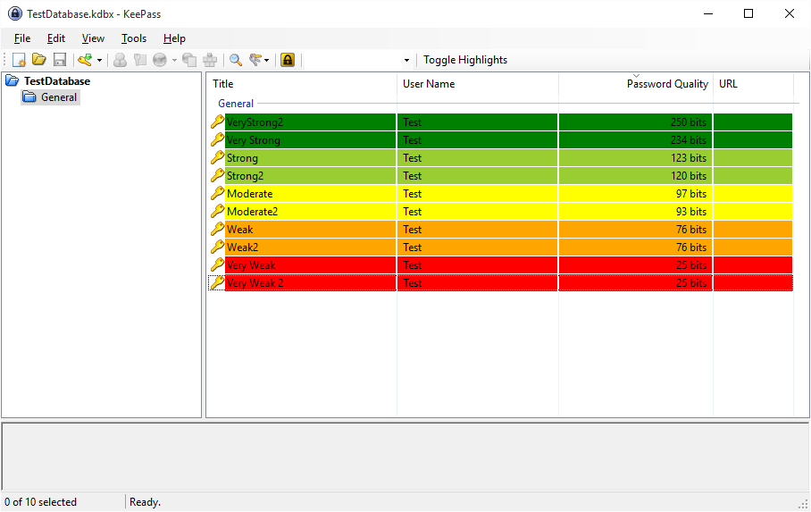

# QualityHighlighter
QualityHighlighter plugin for KeePass 2.x.
Copyright (C) 2016-2017 by Scott Richter (scott.d.richter at gmail.com)

Modified by jaege.

QualityHighlighter is a simple plugin for KeePass that highlights entries based on the password quality. Highlighting is categorized (based on the KeePass website at http://keepass.info/help/kb/pw_quality_est.html) as follows:

|    Type     | Quality (bit) | Color(Hexcode ARGB) |
| ----------- | ------------: | ------------------: |
| No password |             0 |   White(0xFFFFFFFF) |
| Very Weak   |          1-64 |     Red(0xFFFF0000) |
| Weak        |         65-80 |        (0xFFFF9933) |
| Moderate    |        81-112 |        (0xFFFFFF66) |
| Strong      |       113-128 |        (0xFFCCFF99) |
| Very Strong |          >128 |        (0xFFCCFFCC) |

The plugin features a button on the KeePass toolbar to toggle the highlights on and off.

Future improvement plan is to have an options dialog to customize quality levels, including the bit cutoffs and highlight colors.

This plugin pairs very well with the QualityColumn plugin available on the KeePass website at http://keepass.info/plugins.html#qcol.

## License

QualityHighlighter is free software; you can redistribute it and/or modify it under the terms of the GNU General Public License as published by the Free Software Foundation; either version 2 of the License, or (at your option) any later version.

## Version History

v1.3: Fixed issues #1, #4, and #5. Now compatible with TrayTOTP. No longer scrolls the window when toggling state. 0-bit entries use white background color.

v1.2: Added saving of highlighting toggle state. It will not persist after closing and reopening KeePass. Fixed issue with highlighting being wrong on entries where the password is a reference to another password.

v1.1: Corrected the toggle option so it retains the alternating background colors that are default in KeePass when toggled off rather than setting them all to transparent.

v1.0: Initial release with basic highlighting functionality and toggle option.
